# Mapa Conceptual — Fundamentos y Desarrollo Web

> Renderiza este archivo con la extensión **Markdown Preview Mermaid Support** en VS Code,
> o pega el bloque en [https://mermaid.live](https://mermaid.live)

```mermaid
graph TD
    classDef root     fill:#2c3e50,color:#fff,stroke:#1a252f,font-weight:bold
    classDef rama1    fill:#8e44ad,color:#fff,stroke:#6c3483
    classDef rama2    fill:#2471a3,color:#fff,stroke:#1a5276
    classDef rama3    fill:#138d75,color:#fff,stroke:#0e6655
    classDef rama4    fill:#ca6f1e,color:#fff,stroke:#a04000
    classDef rama5    fill:#cb4335,color:#fff,stroke:#922b21
    classDef rama6    fill:#1e8449,color:#fff,stroke:#145a32
    classDef rama7    fill:#b7950b,color:#fff,stroke:#9a7d0a
    classDef rama8    fill:#e74c3c,color:#fff,stroke:#c0392b

    %% ═══════════════════════════════
    %% NODO RAÍZ
    %% ═══════════════════════════════
    WWW["World Wide Web"]
    class WWW root

    %% ═══════════════════════════════
    %% RAMA 1 · Contenido Web
    %% ═══════════════════════════════
    LM["Lenguaje de Marcado"]
    SW["Sitio Web"]
    PW["Página Web"]
    PoW["Portal Web"]
    class LM,SW,PW,PoW rama1

    %% ═══════════════════════════════
    %% RAMA 2 · Identificación y Protocolo
    %% ═══════════════════════════════
    IR["Identificadores de Recursos"]
    URI["URI"]
    URL["URL"]
    HT["Hipertexto"]
    HTTP["HTTP"]
    HTTPS["HTTPS"]
    Cookies["Cookies"]
    MGET["GET"]
    MPOST["POST"]
    MPUT["PUT"]
    MDEL["DELETE"]
    MPATCH["PATCH"]
    class IR,URI,URL,HT,HTTP,HTTPS,Cookies,MGET,MPOST,MPUT,MDEL,MPATCH rama2

    %% ═══════════════════════════════
    %% RAMA 3 · Arquitectura
    %% ═══════════════════════════════
    MCS["Modelo Cliente-Servidor"]
    N2["2 Niveles"]
    N3["3 Niveles"]
    NN["N Niveles"]
    AW["Arquitectura Web"]
    CLI["Clientes"]
    CW["Conexión Web"]
    SRV["Servidor Web"]
    class MCS,N2,N3,NN,AW,CLI,CW,SRV rama3

    %% ═══════════════════════════════
    %% RAMA 4 · Lenguajes de Representación
    %% ═══════════════════════════════
    LRE["Lenguajes de Representación de Estructura"]
    NXML["XML"]
    NJSON["JSON"]
    NSQL["SQL"]
    class LRE,NXML,NJSON,NSQL rama4

    %% ═══════════════════════════════
    %% RAMA 5 · API
    %% ═══════════════════════════════
    NAPI["API"]
    AP2P["Punto a Punto"]
    APIAD["Acceso a Datos"]
    APICS["Cliente-Servidor"]
    APITR["Comunicación en Tiempo Real"]
    class NAPI,AP2P,APIAD,APICS,APITR rama5

    %% ═══════════════════════════════
    %% RAMA 6 · Desarrollo Web
    %% ═══════════════════════════════
    NPHP["PHP"]
    LF["Librerías y Frameworks"]
    AJAX["AJAX"]
    LDF["Librerías de Diseño Frontend"]
    FFR["Frameworks Frontend"]
    FBK["Frameworks Backend"]
    jQ["jQuery"]
    Proto["Prototype"]
    Boot["Bootstrap"]
    MatD["Material Design"]
    KO["Knockout"]
    NG["Angular"]
    Kraken["Kraken"]
    Mach["Mach"]
    Sym["Symphony"]
    Lara["Laravel"]
    Zend["Zend"]
    Spri["Spring"]
    class NPHP,LF,AJAX,LDF,FFR,FBK,jQ,Proto,Boot,MatD,KO,NG,Kraken,Mach,Sym,Lara,Zend,Spri rama6

    %% ═══════════════════════════════
    %% RAMA 7 · Prototipado
    %% ═══════════════════════════════
    HP["Herramientas de Prototipado"]
    class HP rama7

    %% ═══════════════════════════════
    %% RAMA 8 · Laravel en detalle
    %% ═══════════════════════════════
    MVC["MVC"]
    EC["Estructura de Carpetas"]
    BREEZE["Starter Kit de Auth - Breeze"]
    BLADE["Blade"]
    PLANT["Plantillas"]
    MIG["Migraciones"]
    SFact["Seeders y Factories"]
    ART["Comandos php artisan"]
    class MVC,EC,BREEZE,BLADE,PLANT,MIG,SFact,ART rama8

    %% ═══════════════════════════════
    %% CONEXIONES
    %% ═══════════════════════════════

    %% Raíz → Ramas principales
    WWW -->|"se presenta mediante"| LM
    WWW -->|"se accede a través de"| IR
    WWW -->|"usa como protocolo"| HT
    WWW -->|"se organiza en"| MCS
    WWW -->|"se desarrolla con"| LF

    %% Rama 1 · Contenido
    LM      -->|"estructura"| SW
    SW      -->|"compuesto por"| PW
    SW      -->|"puede ser un"| PoW
    SW      -->|"se planifica con"| HP

    %% Rama 2 · Identificación
    IR      -->|"tipo general"| URI
    URI     -->|"caso específico"| URL

    %% Rama 2 · Protocolo
    HT      -->|"implementado en"| HTTP
    HTTP    -->|"versión segura"| HTTPS
    HTTPS   -->|"gestiona"| Cookies
    HTTP    -->|"define métodos"| MGET
    HTTP    -->|"define métodos"| MPOST
    HTTP    -->|"define métodos"| MPUT
    HTTP    -->|"define métodos"| MDEL
    HTTP    -->|"define métodos"| MPATCH

    %% Rama 3 · Arquitectura
    MCS     -->|"se clasifica en"| N2
    MCS     -->|"se clasifica en"| N3
    MCS     -->|"se clasifica en"| NN
    MCS     -->|"da origen a"| AW
    AW      -->|"está formada por"| CLI
    AW      -->|"está formada por"| CW
    AW      -->|"está formada por"| SRV

    %% Rama 4 · Lenguajes de Representación
    CW      -->|"intercambia datos mediante"| LRE
    LRE     -->|"formato"| NXML
    LRE     -->|"formato"| NJSON
    LRE     -->|"consulta estructurada"| NSQL

    %% Rama 5 · API
    SRV     -->|"expone servicios a través de"| NAPI
    NAPI    -->|"se clasifica en"| AP2P
    NAPI    -->|"se clasifica en"| APIAD
    NAPI    -->|"se clasifica en"| APICS
    NAPI    -->|"se clasifica en"| APITR

    %% Rama 6 · Desarrollo
    SRV     -->|"implementado en"| NPHP
    CLI     -->|"usa"| LF
    NPHP    -->|"usa"| LF
    LF      -->|"técnica de comunicación"| AJAX
    AJAX    -.->|"se apoya en"| LRE
    LF      -->|"incluye"| LDF
    LF      -->|"incluye"| FFR
    LF      -->|"incluye"| FBK
    LDF     -->|"ej."| jQ
    LDF     -->|"ej."| Proto
    LDF     -->|"ej."| Boot
    LDF     -->|"ej."| MatD
    FFR     -->|"ej."| KO
    FFR     -->|"ej."| NG
    FBK     -->|"ej."| Kraken
    FBK     -->|"ej."| Mach
    FBK     -->|"ej."| Sym
    FBK     -->|"ej."| Lara
    FBK     -->|"ej."| Zend
    FBK     -->|"ej."| Spri

    %% Rama 8 · Laravel detalle
    Lara    -->|"implementa patrón"| MVC
    Lara    -->|"organiza código en"| EC
    Lara    -->|"provee autenticación con"| BREEZE
    Lara    -->|"usa motor de vistas"| BLADE
    BLADE   -->|"permite crear"| PLANT
    Lara    -->|"gestiona BD con"| MIG
    Lara    -->|"genera datos de prueba con"| SFact
    Lara    -->|"se opera desde terminal con"| ART
```

---

### Leyenda de colores

| Color | Rama |
|---|---|
| ⬛ Gris oscuro | Raíz — World Wide Web |
| 🟣 Morado | Contenido Web |
| 🔵 Azul | Identificación y Protocolo |
| 🟢 Verde oscuro | Arquitectura Web |
| 🟠 Naranja | Lenguajes de Representación |
| 🔴 Rojo oscuro | API |
| 🟢 Verde claro | Desarrollo Web (Librerías, Frameworks, PHP) |
| 🟡 Amarillo | Herramientas de Prototipado |
| 🔴 Rojo | Laravel en detalle |

### Relaciones cruzadas
- La línea punteada (`AJAX -.-> Lenguajes de Representación`) indica una **relación cruzada** entre ramas: AJAX depende de los mismos formatos de datos (JSON/XML) que circulan por la Conexión Web.
